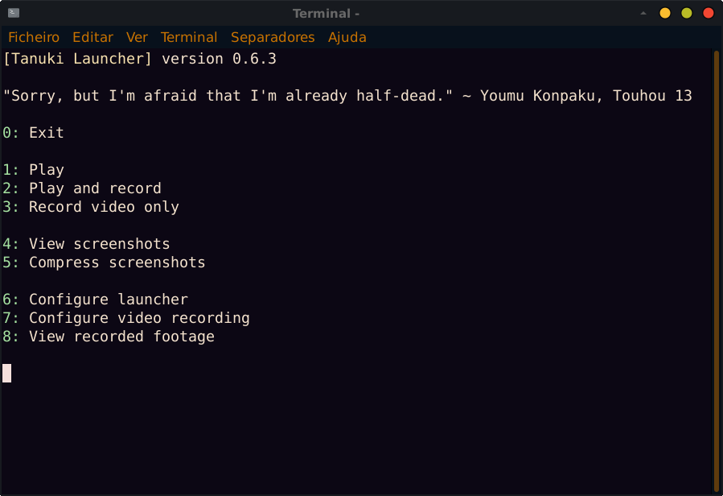

# BananaTUI

BananaTUI is a simple TUI library for Scala 3. With it, you can make option-based TUI interfaces for your programs.

BananaTUI only depends on a terminal environment that supports ANSI, and so it works on nearly all terminal environments and emulators, except for the default terminal that comes with Powershell on Windows.

<p align="center">

</p>

*BananaTUI being used to power [Tanuki Launcher](https://github.com/spacebanana420/tanuki)*

# How to use

Download the library from the releases or from the git repository and add the library source to your project's.

Import the following package:
```scala
import bananatui.*
```

Scala 3 is required for this library.

# Documentation

All the library functions are documented below.

#### [Base functions](doc/base.md)
#### [User input functions](doc/userinput.md)
